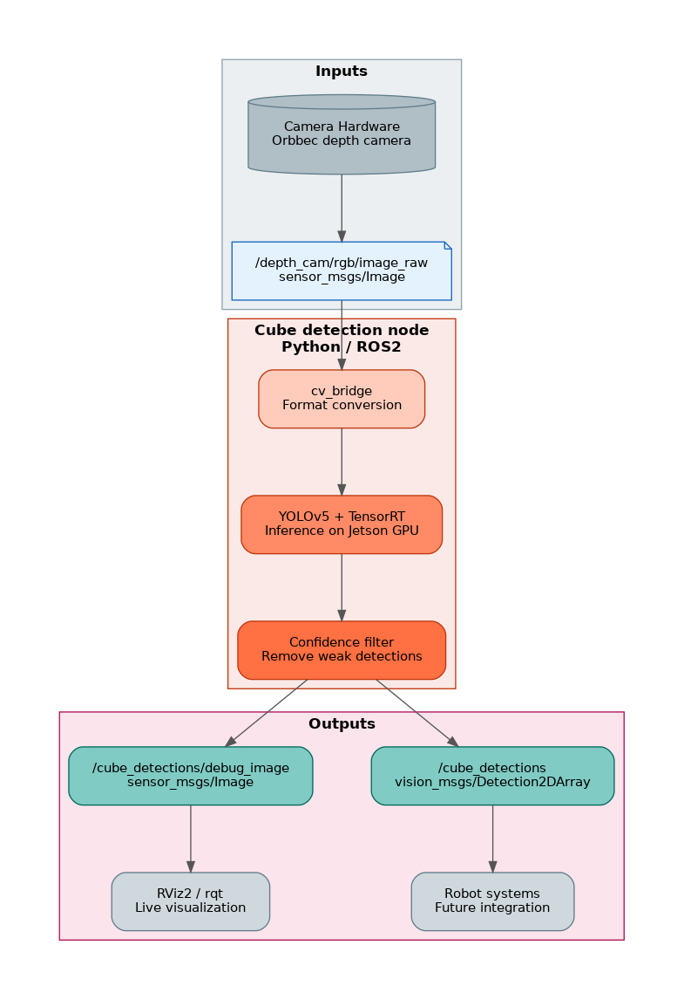

# Recognition of Different Colored Cubes

Detect and classify red, green, and blue cubes in real time using the JetRover onboard camera, YOLOv5, TensorRT, and ROS 2.

---

## What it does

This project runs real-time cube detection on a live camera feed from a HiWonder JetRover. A YOLOv5s model finds cube-shaped objects and classifies them as `red_cube`, `green_cube`, or `blue_cube` — not just any colored region in the scene. Inference runs on the Jetson GPU via TensorRT; results are published as ROS 2 `vision_msgs/Detection2DArray` plus an annotated debug image for visualization.

Pretrained Roboflow weights are used by default; optional Colab fine-tuning applies only if accuracy on the robot camera needs improvement. Target operating distance: **20–80 cm** from the camera.

Built on a HiWonder JetRover with NVIDIA Jetson Orin Nano.

---

## What I built

- Real-time object detection on edge hardware (Jetson Orin Nano)
- ML deployment pipeline: PyTorch weights → ONNX → TensorRT FP16
- ROS 2 perception node (`cube_detection_node`) publishing detections and a debug image
- Documented optional fine-tune path if the pretrained model underperforms on the robot camera

---

## Architecture



Full pipeline details, ROS 2 topics, and training/export path → [`docs/architecture.md`](docs/architecture.md)

---

## Results

> **TODO:** Fill this section after running the pipeline on hardware and completing the 50-frame evaluation.

### Summary

<!-- One short paragraph: did it work, what accuracy/fps achieved, any fine-tuning needed -->

_TBD — add after project completion._

### Metrics

| Metric | Target | Result |
|--------|--------|--------|
| Classification accuracy | ≥ 80% (50-frame test) | TBD |
| Inference rate | ≥ 5 fps on Jetson | TBD |
| Operating distance | 20–80 cm | TBD |

### Demo

<!-- Optional TODO: add assets/results/detection_screenshot.png and uncomment the line below -->

<!--  -->

_Screenshot or clip of live detections — add here after Milestone 5/6._

_Evaluation protocol and per-class breakdown: [`docs/evaluation.md`](docs/evaluation.md)_

---

## Requirements

| | Jetson (robot) | Dev machine |
|--|----------------|-------------|
| **Role** | Runs detection | Edit code, visualize (RViz2) |
| **OS / ROS / Python** | 22.04 / Humble / 3.10 | 22.04 / Humble / 3.10 |
| **Hardware** | JetRover, Orbbec depth camera | — |
| **Key software** | TensorRT, YOLOv5, OpenCV, cv_bridge | RViz2 (optional) |

Full dependencies and model artifacts → [`docs/technical-stack.md`](docs/technical-stack.md)

---

## Quick Start

> **Note:** Inference is not live yet. Below: how to build the package today, and the intended workflow on the Jetson once the model and node are implemented.

### Build the package (dev machine — works now)

```zsh
cd ~/maher_ws
colcon build --packages-select recognition_of_different_colored_cubes
source install/setup.bash
ros2 run recognition_of_different_colored_cubes cube_detection_node
```

Expected: node logs a scaffold initialization message. Exits cleanly on Ctrl+C.

### Run on the Jetson (after model + node are implemented)

```zsh
ssh ubuntu@192.168.2.138   # DHCP — update if changed

sudo systemctl stop start_app_node.service

cd ~/jetson_ws/src
git clone <repo-url> Recognition-of-Different-Colored-Cubes

cd ~/jetson_ws
rosdep install --from-paths src --ignore-src -r -y
colcon build --packages-select recognition_of_different_colored_cubes --symlink-install
source install/setup.bash

ros2 launch recognition_of_different_colored_cubes detection.launch.py
```

View detections: `ros2 run rqt_image_view rqt_image_view` → topic `/cube_detections/debug_image`

### Verify camera (first hardware step)

```zsh
ros2 topic list
ros2 topic hz /depth_cam/rgb/image_raw
ros2 run rqt_image_view rqt_image_view
```

Full ordered setup steps → [`docs/milestones.md`](docs/milestones.md)

---

## Key Directories

| Path | Purpose |
|------|---------|
| `recognition_of_different_colored_cubes/` | ROS 2 Python package — `cube_detection_node.py` |
| `launch/` | `detection.launch.py` |
| `config/` | Node parameters (`params.yaml`) |
| `scripts/` | ONNX export, TensorRT conversion, standalone inference test |
| `models/` | `best.pt`, `best.onnx`, `.engine` — gitignored, not committed |
| `training/` | Optional Colab fine-tune notebook |
| `evaluation/` | 50-frame structured test script |
| `assets/` | Pipeline diagrams; `assets/results/` for evaluation screenshots |
| `docs/` | Architecture, milestones, logbook, evaluation protocol |
| `vendor/` | Reference notes for Hiwonder vendor code (not copied) |

Browse the full tree on GitHub — this table only highlights non-obvious layout.

---

## Documentation

### For visitors

| Document | Description |
|----------|-------------|
| [`docs/architecture.md`](docs/architecture.md) | How the pipeline works — topics, node, diagrams |
| [`docs/Concept-and-Approach.md`](docs/Concept-and-Approach.md) | Why YOLOv5 + TensorRT; model strategy |
| [`docs/evaluation.md`](docs/evaluation.md) | How results are measured |

### Development notes

| Document | Description |
|----------|-------------|
| [`docs/project-definition.md`](docs/project-definition.md) | Problem definition, classes, constraints |
| [`docs/technical-stack.md`](docs/technical-stack.md) | Runtime stack, dependencies, model artifacts |
| [`docs/milestones.md`](docs/milestones.md) | Implementation milestones and ordered steps |
| [`docs/LOGBOOK.md`](docs/LOGBOOK.md) | Session-by-session development log |

---

## License

Apache-2.0 — see [`LICENSE`](LICENSE).
