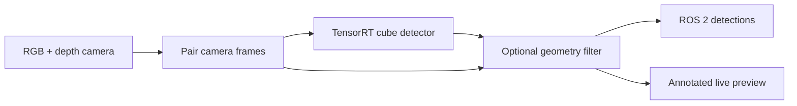

# Recognition of Different Colored Cubes

A ROS 2 computer-vision project that detects red, green, and blue cubes from a live camera on **NVIDIA Jetson hardware**. It combines a fine-tuned YOLOv5u-small detector, TensorRT inference, and an optional depth-based geometry filter.

The goal is to identify cubes and their image locations, then use depth to support reliable localization and reject similarly colored distractors. Detection has been demonstrated on a HiWonder JetRover; reliable depth-based localization remains unfinished.

[Architecture](docs/architecture.md) · [Training workflow](docs/training-and-validation-workflow.md) · [Documentation](docs/README.md) · [Presentation](artifacts/presentation/README.md)

## How it works

The node pairs RGB and depth frames, detects cubes, optionally checks their geometry, and publishes detection messages and an annotated preview. It still requires synchronized depth input when the geometry filter is disabled.



See the [system architecture](docs/architecture.md) for topics, message types, and implementation details.

## Current results and limitations

**Development status: 13 September 2026.** A general pretrained model was fine-tuned on 23 reviewed robot-camera images, evaluated on 8 separate validation images, and converted to TensorRT FP16 on the target Jetson.

| Check | Observed result |
|---|---|
| Saved validation predictions | 17 of 18 cubes visibly detected; one red cube missed; no additional visible boxes |
| Brief live test, geometry filter off | All three colors detected together; an empty scene produced no detection |
| Live comparison, geometry filter on | Real cubes were rejected as `flat`; rejection stage identified, root cause unresolved |

These development results and brief live observations do not establish broad reliability. Full 20–80 cm coverage and reliable depth-based localization remain unverified. The new engine was selected temporarily for testing; it has not replaced the older default engine.

Evidence: [validation comparison](docs/validation-prediction-review-2026-09-13.md), [live test record](docs/development-learning-journal/2026-09-13-sunday.md), and [evaluation summary](docs/evaluation.md). Earlier June reports describe a different model and test period.

## Requirements and setup

This repository is a ROS package for an existing Jetson/JetRover environment, not a complete robot system image.

| Purpose | Required environment | Equipment used in this project |
|---|---|---|
| Live detection | ROS 2 Humble, Python 3.10, compatible TensorRT/PyCUDA, RGB/depth/camera-info topics, vendor `interfaces` messages, and a compatible engine | Ubuntu 22.04, NVIDIA Jetson Orin Nano on JetRover, Orbbec depth camera, TensorRT 8.6.2 |
| Training and export | Compatible PyTorch/Ultralytics environment; CUDA GPU for the documented training recipe | Ubuntu 22.04, NVIDIA RTX 4070 Ti, project `.venv-m2` |

The RTX 4070 Ti is the tested training machine, not a requirement for that exact GPU model. Other hardware configurations have not been verified here.

For a fresh checkout:

1. Prepare the ROS and vendor camera environment. Dependency declarations are in [package.xml](package.xml); runtime details are in the [technical stack](docs/technical-stack.md).
2. Place this repository under your ROS workspace's `src/` directory. The vendor `interfaces` package must also be available.
3. Obtain or train model weights, export to ONNX, and build a compatible TensorRT engine on the target Jetson. Follow the [training and validation workflow](docs/training-and-validation-workflow.md) and [recorded deployment steps](docs/development-learning-journal/2026-09-13-sunday.md). Model binaries and raw datasets are not supplied by Git.
4. Build the package, then select your engine explicitly when starting the detector.

The commands below use the existing `maher_ws` workspace and Zsh. Adapt paths for your installation; use `setup.bash` if your shell is Bash. This is a documented development environment, not a verified automated installation for arbitrary machines.

## Quick Start

### Build in a prepared workspace

With ROS 2 and the vendor dependencies installed, run on the target machine when the detector is stopped:

```zsh
source /opt/ros/humble/setup.zsh
cd ~/maher_ws
colcon build --packages-select recognition_of_different_colored_cubes --symlink-install
source install/setup.zsh
```

### Run on the configured JetRover

The vendor camera must already be running, the workspace built, and the dated engine transferred and verified. A Git pull does not transfer model weights.


In an SSH session on the robot:

```zsh
source /opt/ros/humble/setup.zsh
source /home/ubuntu/maher_ws/install/setup.zsh
ros2 run recognition_of_different_colored_cubes cube_detection_node \
  --ros-args \
  --params-file /home/ubuntu/maher_ws/src/Recognition-of-Different-Colored-Cubes/config/params.yaml \
  -p model_path:=/home/ubuntu/maher_ws/best_2026-09-12.engine \
  -p confidence_threshold:=0.25 \
  -p filter_enabled:=false
```

Open the existing web-video service at
[the debug view](http://192.168.2.138:8080/stream_viewer?topic=/cube_detections/debug_image).
The address is LAN-specific and may change with DHCP. The vendor camera and web-video service must be running. Desktop rqt topic discovery was not fully repaired; the browser was the working preview route.

Stop the foreground node with Ctrl+C before restarting it. To compare the geometry filter, restart the same command with `filter_enabled:=true`; the September test then rejected the real cubes. This is a diagnostic comparison, not an accepted production configuration.


### Essential settings

| Setting | YAML default | September live diagnostic |
|---|---|---|
| `model_path` | Automatic search for older `best.engine` | Explicit dated engine path |
| `confidence_threshold` | `0.50` | `0.25` |
| `filter_enabled` | `true` | `false` |

Restart the node to apply changes to its cached settings. Full topic, synchronization, calibration, and geometry options are in the [configuration reference](docs/configuration.md), with defaults in [config/params.yaml](config/params.yaml).

## Training and evaluation

The workflow is: capture scenes → review annotations → export separate training and validation sets → fine-tune → inspect predictions → export and deploy → test live.

- [Training and validation workflow](docs/training-and-validation-workflow.md): inputs, scripts, and stage outputs.
- [Methodology review](docs/training-validation-methodology-review.md): why validation scenes are kept separate.
- [Training record](docs/development-learning-journal/2026-09-12-saturday.md): executed settings and results.
- [Script index](scripts/README.md): current capture, preparation, training, and diagnostic tools.

Validation supports model development. Fresh live tests are needed to assess behavior on the robot; high validation scores alone do not establish deployment readiness.

## Repository and documentation

| Location | Contents |
|---|---|
| `recognition_of_different_colored_cubes/` | Detector node and geometry helper |
| `config/`, `launch/` | ROS settings and detector launch file |
| `scripts/` | Dataset, training, inference, and evaluation utilities |
| `models/` | Model inventory; binaries are local artifacts |
| `evaluation/` | Dataset manifests, annotation reviews, and reports |
| `docs/` | Architecture, research, learning journal, and evaluation guidance |
| `artifacts/presentation/` | Current English slides, notes, and tutor questions |

Start with the [documentation index](docs/README.md). See [milestones](docs/milestones.md) for remaining engineering work and the [presentation package](artifacts/presentation/README.md) for the current talk. Archive directories contain historical material, not current operating instructions.

## Maintainer and contributions

Maintained by **Maher Alshirazi Alsabbagh**. Maher captured and reviewed the data, ran training and deployment, and interpreted results. Codex assisted with implementation, checks, and documentation; camera software and machine-learning libraries are reused.

Report problems or propose improvements through [GitHub Issues](https://github.com/mahersabbagh80/Recognition-of-Different-Colored-Cubes/issues). For a detector issue, include the code version, hardware/software environment, model identity, relevant settings, and observed behavior. Discuss substantial changes before submitting a pull request.

## License and references

Project code is licensed under [Apache-2.0](LICENSE). External software and datasets retain their own licenses.

- [HiWonder JetRover ROS and machine-learning documentation](https://docs.hiwonder.com/projects/JetRover/en/jetson-orin-nano/docs/6.ROS%2BMachine_Learning_Course.html)
- [Concept and method choices](docs/Concept-and-Approach.md)
- [Technical stack and model identity](docs/technical-stack.md)
