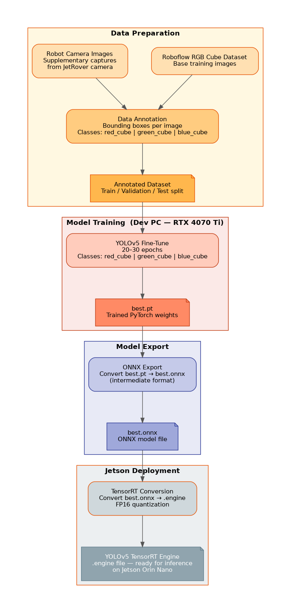

# Architecture

## Inference pipeline

Source: [`assets/concept2_inference_pipeline.dot`](../assets/concept2_inference_pipeline.dot)

- The Orbbec depth camera publishes RGB frames on `/depth_cam/rgb/image_raw` (`sensor_msgs/Image`).
- `cube_detection_node` subscribes to the camera topic and converts each frame to OpenCV format via `cv_bridge`.
- YOLOv5 + TensorRT runs inference on the Jetson GPU, outputting bounding boxes and class labels for `red_cube`, `green_cube`, and `blue_cube`.
- A confidence filter discards detections below the configured threshold.
- Filtered results are published as `vision_msgs/Detection2DArray` on `/cube_detections`.
- An annotated debug image is published on `/cube_detections/debug_image` for live visualization.

---

## Training pipeline

Source: [`assets/concept2_training_pipeline.dot`](../assets/concept2_training_pipeline.dot)

See also: [approach rationale](Concept-and-Approach.md)

- **Default:** Download pretrained `best.pt` from [Roboflow Universe](https://universe.roboflow.com/jakub-slof/red-green-blue-cube-detection/dataset/1) — no custom training upfront.
- Export `best.pt` → `best.onnx` (intermediate format; version compatibility checkpoint).
- Convert `best.onnx` → TensorRT FP16 `.engine` on the Jetson.
- **If robot-camera accuracy fails:** fine-tune locally on dev PC (RTX 4070 Ti, Roboflow dataset, 20–30 epochs) — see optional path in the diagram above.

**Fallback:** If TensorRT conversion fails, run inference via ONNX Runtime (slower but functional).

---

## Why each component is in the pipeline

| Component | Role | Why this choice |
|-----------|------|----------------|
| `cube_detection_node` | Single ROS 2 node for the full detection pipeline | Keeps the system simple for a one-week project; one node subscribes, infers, and publishes |
| `cv_bridge` | ROS Image ↔ OpenCV conversion | Standard ROS 2 bridge; required to pass camera frames to OpenCV/YOLOv5 |
| YOLOv5s | Object detection + classification | Learns shape and color jointly; industry-standard, runs on local CUDA GPU |
| TensorRT | GPU-accelerated inference | Required for ≥ 5 fps on Jetson Orin Nano |
| `vision_msgs/Detection2DArray` | Detection output format | Standard ROS 2 vision message; compatible with RViz2 and future robot integration |

---

## Topics

| Topic | Message Type | Publisher | Subscriber(s) |
|-------|-------------|-----------|---------------|
| `/depth_cam/rgb/image_raw` | `sensor_msgs/Image` | Orbbec camera driver | `cube_detection_node` |
| `/cube_detections` | `vision_msgs/Detection2DArray` | `cube_detection_node` | Robot systems (future), RViz2 |
| `/cube_detections/debug_image` | `sensor_msgs/Image` | `cube_detection_node` | RViz2, `rqt_image_view` |

- `/depth_cam/rgb/image_raw` — live RGB frames from the onboard Orbbec camera. Verify topic name on hardware with `ros2 topic list` before assuming.
- `/cube_detections` — filtered detections with bounding boxes, class IDs, and confidence scores.
- `/cube_detections/debug_image` — camera frame with bounding boxes and class labels drawn for debugging and visualization.

---

## Node

| Property | Value |
|----------|-------|
| Node name | `cube_detection_node` |
| Package | `recognition_of_different_colored_cubes` |
| Config | `config/params.yaml` |
| Launch | `launch/detection.launch.py` |
