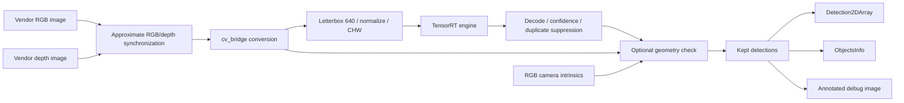

# System architecture

Updated 13 September 2026 against the current node, launch and configuration. The pipeline is implemented, but the geometry-filtered output is not accepted as reliable.

## Runtime flow

The current node synchronizes RGB and depth even with the geometry filter disabled. Depth is expected to be aligned to the RGB view; the observed filter failure does not establish that this assumption holds correctly in every tested frame.

## Inputs and outputs

| Topic | Message | Role |
|---|---|---|
| /depth_cam/rgb/image_raw | sensor_msgs/Image | Camera image |
| /depth_cam/depth/image_raw | sensor_msgs/Image | Depth sampled by geometry stage |
| /depth_cam/rgb/camera_info | sensor_msgs/CameraInfo | Intrinsics loaded into filter parameters |
| /cube_detections | vision_msgs/Detection2DArray | Kept image-space detections |
| /cube_detections/vendor_objects | interfaces/ObjectsInfo | Vendor-compatible output |
| /cube_detections/debug_image | sensor_msgs/Image | Visible boxes, scores and status |

The output interface's existence does not prove correct physical localization. That needs its own validation.

## Ownership and configuration

Vendor software owns camera startup. The project [cube_detection_node.py](../recognition_of_different_colored_cubes/cube_detection_node.py) performs conversion, inference, filtering and publication. [geometry_filter.py](../recognition_of_different_colored_cubes/geometry_filter.py) implements geometric statistics and decisions.

[detection.launch.py](../launch/detection.launch.py) starts only the detector. [package.xml](../package.xml) already declares interfaces and message_filters. The previously proposed vendor-camera convenience launch is not implemented and is not required for the recorded test.

[config/params.yaml](../config/params.yaml) supplies startup settings. The node caches parameter values during initialization: restart it with explicit overrides to change model, confidence or filter state. The current default configuration and the September diagnostic configuration differ; see the [tested start command](../README.md#quick-start).

## Model preparation

Desktop capture review and fine-tuning → selected PyTorch checkpoint → ONNX export → TensorRT engine built on Jetson → explicit engine path supplied to the ROS node. Training does not run inside live inference.

The verified engine contract is input [1,3,640,640] and output [1,7,8400]. Classes are 0 blue_cube, 1 green_cube, 2 red_cube. See [technical stack](technical-stack.md) for paths and fingerprints.

## Geometry filter and current limitation

The filter evaluates depth support, raised fraction, shape ratio and planar-top variation. With it disabled, model candidates pass through. With it enabled in September's test, all observed candidates were rejected as flat, including genuine cubes. Depth alignment, box coverage and filter assumptions remain possible causes, not established diagnoses.

The [Sunday walkthrough](development-learning-journal/2026-09-13-sunday.md) contains the detailed architecture sketch, commands and observations. The previous proposal is preserved in [the historical snapshot](archive/pre-september-refresh/architecture.md).
