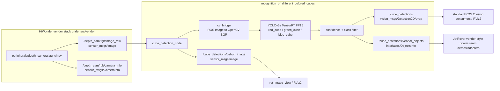

# Architecture

This revision is vendor-first: project code remains in `src/Recognition-of-Different-Colored-Cubes`, while HiWonder packages under `src/vendor` provide camera bring-up, topic conventions, and the vendor object-message compatibility contract. Do not modify `src/vendor`.

Upstream research handoff: [`vendor-audit.md`](vendor-audit.md). Main vendor references: `src/vendor/peripherals/launch/depth_camera.launch.py`, `src/vendor/example/example/yolov5_detect/yolov5_node.py`, and `src/vendor/interfaces/msg/{ObjectInfo,ObjectsInfo}.msg`.

---

## Vendor-aligned inference pipeline



Design rationale:

- Use vendor `peripherals` for camera ownership. The project node should subscribe to the vendor RGB stream instead of opening the camera directly.
- Keep `cube_detection_node` as one small perception node for this project scope: subscribe, infer, filter, publish standard + vendor-compatible outputs.
- Reuse vendor-proven patterns from `example/yolov5_detect/yolov5_node.py`: `/depth_cam/rgb/image_raw`, `cv_bridge`, bounded frame queue that drops stale frames, TensorRT YOLO reference path, debug image publisher, and `interfaces/ObjectsInfo` shape.
- Do not make vendor LAB color detection the main path. It is useful as a camera/lighting diagnostic and baseline, but it detects colored blobs rather than learned cube objects.

---

## Camera input and launch boundary

Recommended default: assume the vendor camera stack is already running, and keep this package's default launch focused on `cube_detection_node`.

Why:

- Vendor camera launch depends on environment variables (`need_compile=True`, `DEPTH_CAMERA_TYPE=Dabai`, plus workspace-level `MACHINE_TYPE`, `LIDAR_TYPE`, `HOST`, `MASTER`). Keeping it outside the default project launch makes failures easier to diagnose.
- Camera bring-up is shared robot infrastructure. A recognition node should not own the camera process by default because other JetRover demos or diagnostics may also rely on the same stream.
- This matches the current M1 verification flow: first prove `/depth_cam/rgb/image_raw` exists and has sane QoS/fps, then run detection.

Optional implementer addition, after Maher confirms the desired operator workflow: add a separate convenience launch such as `launch/detection_with_vendor_camera.launch.py` that includes `peripherals/depth_camera.launch.py` before starting `cube_detection_node`.

Do not make the convenience launch the only path. It should be opt-in because the vendor launch raises immediately if required environment variables are missing.

Required vendor camera environment before using `peripherals/depth_camera.launch.py` in this workspace:

```bash
cd ~/maher_ws
source install/setup.bash
export need_compile=True
export MACHINE_TYPE=JetRover_Mecanum
export LIDAR_TYPE=LD19
export HOST=/
export MASTER=
export DEPTH_CAMERA_TYPE=Dabai
ros2 launch peripherals depth_camera.launch.py
```

Expected RGB input topic: `/depth_cam/rgb/image_raw` (`sensor_msgs/Image`). Verify on hardware with:

```bash
ros2 topic list | sort
ros2 topic info /depth_cam/rgb/image_raw -v
ros2 topic hz /depth_cam/rgb/image_raw
```

Use sensor-data QoS for the image subscription unless hardware topic inspection proves a different QoS is required.

---

## Output contract decision

Recommendation: publish both standard and vendor-compatible detection topics.

| Topic | Message Type | Status | Purpose |
|---|---|---|---|
| `/cube_detections` | `vision_msgs/Detection2DArray` | Primary public API | Standard ROS 2 vision contract for RViz/future non-vendor consumers |
| `/cube_detections/vendor_objects` | `interfaces/ObjectsInfo` | Compatibility API | Vendor-shaped output matching HiWonder `example/yolov5_detect` conventions |
| `/cube_detections/debug_image` | `sensor_msgs/Image` | Debug API | Human visualization with boxes/labels/fps overlay |

Rationale:

- `vision_msgs/Detection2DArray` keeps the project aligned with standard ROS 2 vision tooling and the existing portfolio-facing docs.
- `interfaces/ObjectsInfo` makes the project vendor-aligned without forcing every consumer to understand `vision_msgs`. Its `ObjectInfo` shape is `class_name`, `box=[x_min,y_min,x_max,y_max]`, `score`, `width`, `height`, which matches the vendor YOLOv5 demo.
- Publishing only `vision_msgs` ignores the JetRover vendor object-detection contract.
- Publishing only `ObjectsInfo` would reduce portability and require rewriting the existing standard ROS 2 integration plan.

Mapping from model output:

| Model field | `vision_msgs/Detection2DArray` | `interfaces/ObjectInfo` |
|---|---|---|
| Class label | `results[].hypothesis.class_id` | `class_name` |
| Confidence | `results[].hypothesis.score` | `score` |
| Bounding box | `bbox.center`, `bbox.size_x`, `bbox.size_y` | `box=[x_min,y_min,x_max,y_max]` |
| Source image size | Not required by the core bbox fields | `width`, `height` |
| Header/frame/time | Top-level `header` | Not present in vendor message; consumers infer from image stream timing |

Trade-off: dual publishing adds a small amount of conversion and test surface, but it avoids choosing between ROS-standard tooling and vendor compatibility.

---

## ROS 2 node specification

| Property | Value |
|---|---|
| Package | `recognition_of_different_colored_cubes` |
| Node name | `cube_detection_node` |
| Default launch | `launch/detection.launch.py` |
| Config | `config/params.yaml` |
| Main input | `/depth_cam/rgb/image_raw` |
| Main outputs | `/cube_detections`, `/cube_detections/vendor_objects`, `/cube_detections/debug_image` |

Suggested parameters:

| Parameter | Default | Purpose |
|---|---:|---|
| `image_topic` | `/depth_cam/rgb/image_raw` | Vendor RGB image input |
| `detections_topic` | `/cube_detections` | Standard `vision_msgs` output |
| `vendor_objects_topic` | `/cube_detections/vendor_objects` | Vendor `interfaces` output |
| `debug_image_topic` | `/cube_detections/debug_image` | Annotated debug image |
| `confidence_threshold` | `0.5` | Minimum detection confidence |
| `model_path` | `""` | TensorRT engine path once available |
| `publish_vendor_objects` | `true` | Allow disabling vendor compatibility output for tests |
| `publish_debug_image` | `true` | Allow disabling overlay work on resource-constrained runs |

Suggested internal flow:

1. Subscribe to `image_topic` using sensor-data QoS.
2. Convert each frame with `cv_bridge` to BGR OpenCV format.
3. Use a bounded queue of size 1–2 and drop stale frames under load; do not let inference backlog grow.
4. Run TensorRT YOLOv5 inference on the newest frame.
5. Filter to `red_cube`, `green_cube`, `blue_cube` above `confidence_threshold`.
6. Publish the same filtered detection set as both `Detection2DArray` and `ObjectsInfo`.
7. Publish an annotated debug image if enabled.

No ROS services/actions are required for the first recognition-only milestone. A future manipulation phase can add start/stop or ROI services following the vendor `color_detect` pattern.

---

## Topics

| Topic | Message Type | Publisher | Subscriber(s) |
|---|---|---|---|
| `/depth_cam/rgb/image_raw` | `sensor_msgs/Image` | Vendor `peripherals` camera launch | `cube_detection_node` |
| `/depth_cam/rgb/camera_info` | `sensor_msgs/CameraInfo` | Vendor `peripherals` camera launch | Optional future calibration/evaluation tools |
| `/cube_detections` | `vision_msgs/Detection2DArray` | `cube_detection_node` | Robot systems (future), RViz2/adapters/tests |
| `/cube_detections/vendor_objects` | `interfaces/ObjectsInfo` | `cube_detection_node` | JetRover vendor-style consumers/adapters |
| `/cube_detections/debug_image` | `sensor_msgs/Image` | `cube_detection_node` | RViz2, `rqt_image_view` |

---

## Dependency impact

Implementation should add the vendor `interfaces` package as a declared ROS dependency before publishing `/cube_detections/vendor_objects`.

Expected package dependency set:

- existing: `rclpy`, `sensor_msgs`, `vision_msgs`, `cv_bridge`, `std_msgs`
- add: `interfaces`
- likely already needed by implementation/runtime environment: OpenCV, TensorRT, PyTorch/YOLOv5 export tooling, ONNX/ONNX Runtime fallback

Because this is an `ament_python` package, `interfaces` should be an `exec_depend` in `package.xml` when the implementer updates code.

---

## Decisions requiring Maher's review before implementation resumes

1. Approve dual output publishing: `/cube_detections` (`vision_msgs/Detection2DArray`) plus `/cube_detections/vendor_objects` (`interfaces/ObjectsInfo`). This is my recommendation.
2. Approve launch split: default detection launch assumes vendor camera is already running; optional convenience launch may include `peripherals/depth_camera.launch.py`. This is my recommendation.
3. Confirm whether the implementer should update `package.xml` immediately to add `<exec_depend>interfaces</exec_depend>` while adding the vendor output publisher.
4. Confirm whether runtime start/stop services are desired now. I recommend deferring them until after M5 live detection works.

---

## Legacy diagram references

The existing generated PNG diagrams remain useful for the high-level model/export story:

- Inference pipeline: [`assets/concept2_inference_pipeline.png`](../assets/concept2_inference_pipeline.png)
- Source: [`assets/concept2_inference_pipeline.dot`](../assets/concept2_inference_pipeline.dot)
- Training pipeline: [`assets/concept2_training_pipeline.png`](../assets/concept2_training_pipeline.png)
- Source: [`assets/concept2_training_pipeline.dot`](../assets/concept2_training_pipeline.dot)

The Mermaid diagram above is the current vendor-first architecture reference for implementer work.
