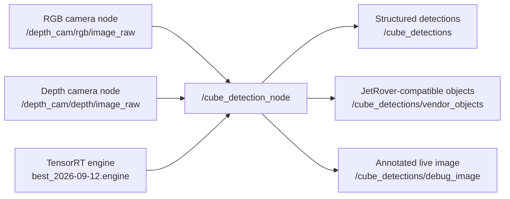
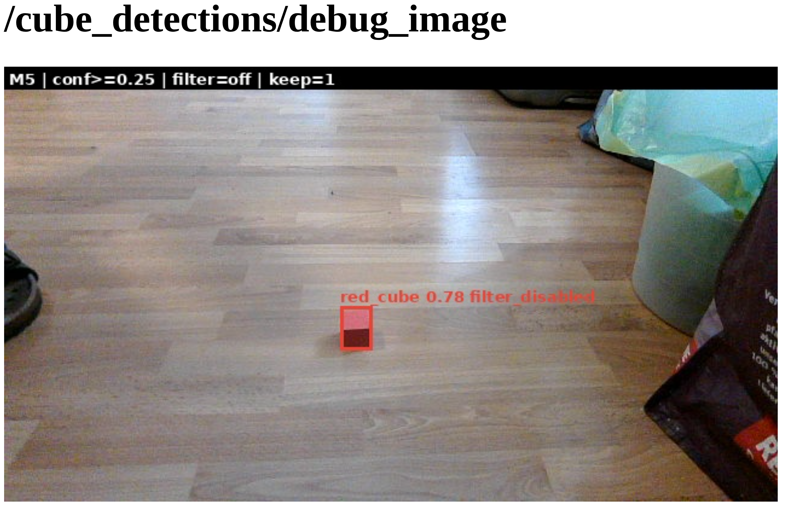

# Sunday, 13 September 2026 — Technical walkthrough

## Per-image validation review prepared

### Purpose

The training run produced one combined image of the approved validation annotations and another combined image of the saved predictions. Those mosaics are useful as a summary but make a careful image-by-image comparison difficult.

### Inputs

- `runs/robot_2026-09-12/experiment_60ep_20260912_221210+0200/val_batch0_labels.jpg`
- `runs/robot_2026-09-12/experiment_60ep_20260912_221210+0200/val_batch0_pred.jpg`

Both mosaics contain the same eight held-out images, V01 through V08.

### Completed action

The two 1920 by 1098 pixel mosaics were divided into their 640 by 366 pixel cells. Sixteen derived JPEG files were written under `docs/assets/validation-review-2026-09-13`: one approved-annotation view and one saved-prediction view for every validation image.

The comparison document `docs/validation-prediction-review-2026-09-13.md` places each pair side by side. Its observations are intentionally pending until Maher and Codex confirm each image together.

### Verification and limitations

All 16 expected comparison files exist. This step reorganized existing training-run evidence for inspection; it did not run the model again and did not change the checkpoint, dataset, annotations, or predictions.

The prediction labels shown are those rendered by Ultralytics in the saved validation mosaic. The visual review is development evidence from eight held-out same-room images. Live robot performance remains untested for this checkpoint.

### V01 jointly reviewed

Maher and Codex compared the approved and predicted views for V01. Both show one green, one blue, and one red cube at corresponding locations. No missed cube or additional prediction is visible. The saved prediction view rounds the displayed confidence to 0.9 for green and 0.8 for blue and red. V02 through V08 remain pending joint review.

### V03 jointly reviewed

Maher identified that the red cube in V03 was absent from the prediction view. Direct comparison confirmed that the approved annotation contains red, green, and blue cubes, while the saved prediction view contains boxes for green and blue only. The red cube is therefore one false negative: a real target that the model did not report in this rendered validation result. No additional prediction is visible in V03.

### Remaining validation images jointly reviewed

Maher judged the remaining prediction views correct, and Codex checked them against the complete approved and prediction mosaics. V02, V04, V05, and V06 each contain three matching cube detections with the correct visible classes and no additional visible detection. V07 is an empty-scene negative example and V08 contains an ordinary bottle; neither produces a cube detection.

Small clipped confidence fragments appear at the left edge of the cropped V07 and V08 prediction views. They come from long V04 and V05 labels crossing cell boundaries in Ultralytics' combined batch mosaic. They are visualization spillover, not predictions assigned to V07 or V08. The comparison document now states explicitly that its per-image views are crops from the saved batch mosaics rather than separately rendered prediction files.

Across this human visual review, V01, V02, V04, V05, and V06 show three correct visible detections each; V03 shows two correct visible detections and one missed red cube; V07 and V08 correctly show no detections. No additional detection was visible. This is a visual interpretation of the rendered validation mosaic, not a replacement for the threshold-integrated metrics in the automated validation report.

### Confusion matrix interpreted together

Maher read the saved `confusion_matrix.png` correctly after the axes were defined: columns are true classes and rows are predicted classes. The diagonal contains six correct blue detections, six correct green detections, and five correct red detections. The cell at predicted background and true red contains one. In an object-detection confusion matrix, this means one real red cube had no matched prediction; it does not mean the detector emitted a fourth class called background. There are no visible off-diagonal color confusions and no predictions against true background in this matrix.

This confirms the visual review's fixed rendered result: 17 matched cube detections out of 18 annotated cubes, with one missed red cube and no displayed false positive. These fixed-count observations should not be substituted for the validation report's precision and recall, which are derived from confidence-ranked predictions across thresholds.

The next planned stage is deployment preflight: inspect the existing JetRover runtime, confirm that it still expects a TensorRT FP16 `best.engine`, and verify the target TensorRT environment before exporting or transferring the new checkpoint. No model export or robot change has been made yet.

### JetRover deployment preflight started

Maher connected to the powered JetRover through the Codex task terminal using the existing SSH alias. The remote shell reported the ROS 2 vendor environment, a Dabai camera selection, and ROS domain ID 0. A direct Python import reported TensorRT 8.6.2.

The first path assumption was wrong: commands initially looked under `/home/ubuntu/jetson_ws`, but Maher correctly recalled that his project workspace is `/home/ubuntu/maher_ws`. Inspection then established:

- the source checkout exists at `/home/ubuntu/maher_ws/src/Recognition-of-Different-Colored-Cubes`;
- its `main` branch has no reported working-tree changes and tracks `origin/main`;
- `origin` points to the expected GitHub repository;
- older `best.onnx` and `best.engine` artifacts exist at the root of `/home/ubuntu/maher_ws`;
- `ros2 pkg prefix recognition_of_different_colored_cubes` initially reported `Package not found`, meaning the current shell had not exposed the project package through the ROS package index;
- the assumed engine path under the nonexistent `jetson_ws` checkout was therefore irrelevant.

The repository intentionally ignores `models/*`, `*.pt`, and `runs/`. A Git pull can update tracked source code but cannot deliver the newly trained checkpoint or generated ONNX/TensorRT files. Those artifacts require a separate export and transfer path. No pull, export, transfer, engine replacement, or ROS launch has occurred yet.

Maher then ran `git pull --ff-only` manually in the JetRover checkout. The command downloaded and checked out many tracked files and returned to the shell prompt without a visible error. Because the output exceeded the Codex terminal buffer, the exact final Git summary was no longer visible; branch cleanliness and the new head commit still require a short post-pull verification before the update is treated as fully confirmed.

The post-pull checks then passed. `git status --short --branch` reported a clean `main` branch aligned with `origin/main`, and the new head was commit `10c51d5` (`Document dataset export and training setup`). The tracked JetRover source checkout is therefore updated. This does not include the ignored model artifacts.

### New checkpoint exported to ONNX

Maher kept the SSH session open in one Codex terminal tab and manually ran the export in a second desktop terminal from the project root:

```bash
.venv-m2/bin/yolo export \
  model=runs/robot_2026-09-12/experiment_60ep_20260912_221210+0200/weights/best.pt \
  format=onnx \
  imgsz=640 \
  opset=13 \
  simplify=False \
  dynamic=False
```

This converts the selected PyTorch checkpoint into an ONNX computation graph; it does not retrain or modify `best.pt`. A static batch-one input was retained because the live node letterboxes each camera image to a fixed 640 by 640 tensor, and the target JetRover uses TensorRT 8.6.2. Simplification was disabled to keep the previously tested export recipe.

Ultralytics 8.4.75 reported a successful export in 0.4 seconds and wrote:

`runs/robot_2026-09-12/experiment_60ep_20260912_221210+0200/weights/best.onnx`

The file is 36,671,681 bytes. Independent inspection with ONNX 1.22.0 passed `onnx.checker.check_model` and confirmed IR version 7, opset 13, input `images` with shape `[1, 3, 640, 640]`, and output `output0` with shape `[1, 7, 8400]`. Its SHA-256 is `21ecfbf89f91b7e0a47f1cb415d333ed3426d73fa7b3eca9542a0a51bfd0d589`.

The export ran on the desktop CPU. That is acceptable because this step serializes the model graph; the hardware-specific optimization occurs later when TensorRT builds the engine on the JetRover. No file has yet been transferred to or built on the robot.

Maher then copied the verified ONNX file from the desktop to `/home/ubuntu/maher_ws/best_2026-09-12.onnx` using `scp`. The dated destination name preserves the older `/home/ubuntu/maher_ws/best.onnx` until the new artifact has been checked. The transfer reached 100% for the 35 MB file.

He verified the remote artifact with `ls -lh` and `sha256sum`. The JetRover reported a 35 MB file and SHA-256 `21ecfbf89f91b7e0a47f1cb415d333ed3426d73fa7b3eca9542a0a51bfd0d589`, exactly matching the independently checked desktop ONNX file. The transfer is therefore byte-for-byte verified. No TensorRT engine has been built or activated yet.

### TensorRT FP16 engine built on the JetRover

After reviewing the inputs and settings, Maher manually ran the existing project conversion recipe on the JetRover:

```bash
cd /home/ubuntu/maher_ws

/usr/src/tensorrt/bin/trtexec \
  --onnx=best_2026-09-12.onnx \
  --saveEngine=best_2026-09-12.engine \
  --fp16 \
  --workspace=2048
```

TensorRT 8.6.2 parsed the static ONNX graph with input `[1, 3, 640, 640]`, selected FP32 and FP16 tactics, and built the engine in 825.548 seconds. The dated output name leaves the older `/home/ubuntu/maher_ws/best.engine` unchanged.

The builder warned that `--workspace` is deprecated in favor of `--memPoolSize`, cast exported INT64 weights to INT32, and adjusted 60 subnormal FP16 weights plus four values below the minimum FP16 subnormal value. These warnings did not stop the build, but the FP16 engine still requires an output comparison with the source model before activation.

TensorRT then deserialized the 20 MiB engine and executed a random-input benchmark. It reported 70.8793 queries per second, 14.4487 ms mean host latency, and 13.7924 ms mean GPU compute time. The command ended with `PASSED` and returned to the shell prompt. This verifies engine construction and basic execution; random input does not measure cube-detection accuracy. Remote file size and checksum verification remain the next artifact check, followed by inference comparison before live activation.

The complete `trtexec` performance summary was:

| Measurement | Minimum | Maximum | Mean | Median | P90 | P95 | P99 |
| --- | ---: | ---: | ---: | ---: | ---: | ---: | ---: |
| End-to-end host latency | 14.1877 ms | 14.8346 ms | 14.4487 ms | 14.4390 ms | 14.5466 ms | 14.5779 ms | 14.6602 ms |
| Enqueue time | 2.3936 ms | 3.2533 ms | 2.7016 ms | 2.6948 ms | 2.8865 ms | 2.9648 ms | 3.1484 ms |
| Host-to-device transfer | 0.3611 ms | 0.9927 ms | 0.6225 ms | 0.6167 ms | 0.6729 ms | 0.6868 ms | 0.7263 ms |
| GPU computation | 13.5394 ms | 14.0427 ms | 13.7924 ms | 13.7858 ms | 13.8838 ms | 13.9143 ms | 13.9630 ms |
| Device-to-host transfer | 0.0188 ms | 0.1036 ms | 0.0338 ms | 0.0336 ms | 0.0358 ms | 0.0371 ms | 0.0427 ms |

Additional totals were 70.8793 queries per second, 3.03332 seconds of host wall time, and 2.96536 seconds of accumulated GPU compute time over the benchmark trace. These are synthetic engine-runtime measurements using random input. They exclude camera capture, image preparation, detection decoding, depth filtering, ROS publication, and real-scene accuracy, so they must not be reported as the complete live JetRover frame rate.

Maher then verified the generated artifact directly on the JetRover. `/home/ubuntu/maher_ws/best_2026-09-12.engine` exists as a separate 21 MB file and has SHA-256 `f385e0b56c8d4e517c04bae6ac34013c999d2a20367c59fcdbe3f6ace96fa0c0`. Both read-only checks returned to the shell prompt normally. This records the exact engine that will be used for the next comparison; it has not yet replaced the older active engine.

### TensorRT inference smoke test on V03

Maher manually ran `scripts/test_inference.py` with the new dated engine, the original V03 capture directory, confidence threshold 0.25, and IoU threshold 0.45. The script loaded input binding `images` with shape `[1, 3, 640, 640]` and output binding `output0` with shape `[1, 7, 8400]`, then wrote an annotated PNG and `detections.json` under `/home/ubuntu/maher_ws/tensorrt_smoke_2026-09-13/V03`.

The TensorRT result contained two detections: blue at confidence 0.761 and green at confidence 0.719. It contained no red detection. This matches the previously reviewed PyTorch validation result at the class-presence level: V03 found blue and green but missed the red cube. It is therefore initial evidence that conversion preserved the relevant output behavior. Exact box-coordinate and confidence comparison still requires inspecting the copied artifacts; one image is not a complete conversion-equivalence test.

The single cold inference measured 72.71 ms. This first-call value must not be compared directly with the warmed 3-second `trtexec` benchmark or treated as live-pipeline frame rate. After the successful script run, the two result paths were accidentally entered directly at the shell prompt and produced `permission denied`; that later shell error does not invalidate the inference or its saved files because image and JSON files are data, not executable commands.

### Live ROS preflight

Before starting the new engine on the camera stream, Maher loaded the ROS environments in the JetRover SSH terminal and checked both package discovery and the current ROS graph. The terminal uses Zsh, so the initial `setup.bash` instructions were corrected to the matching `setup.zsh` files:

```zsh
source /opt/ros/humble/setup.zsh
source /home/ubuntu/ros2_ws/install/setup.zsh
source /home/ubuntu/maher_ws/install/setup.zsh
```

`ros2 pkg prefix recognition_of_different_colored_cubes` resolved to the package installed under `/home/ubuntu/maher_ws/install`, confirming that the project overlay is available. `ros2 node list` showed the vendor RGB/depth camera nodes and `web_video_server`, but no `/cube_detection_node`. The live camera infrastructure is therefore running, and no existing cube detector would conflict with a temporary test instance. No detector or new engine was activated during this preflight.

### Live detection architecture

The live test connects the already running camera system to the project's ROS 2 detection node. The RGB camera supplies the visible image used by the neural network. The depth camera supplies the per-pixel distance measurements needed by the optional geometry filter and location output. The TensorRT engine supplies the trained cube detector. The node then publishes structured detections and an annotated debug image.



The camera nodes and web video server are vendor-provided runtime components that were already active. `/cube_detection_node` is the project's component and was absent during the preflight. Starting it with an explicit `model_path` makes the dated candidate engine temporary and reviewable: the older `best.engine` remains unchanged.

For the first live diagnostic, the confidence threshold is explicitly overridden to `0.25` to match the V03 TensorRT comparison, and `filter_enabled` is temporarily set to `false`. This isolates the neural network's raw detections. If a box is missing during this first test, the result cannot have been removed by the downstream depth/geometry filter. A later full-pipeline test must re-enable that filter and verify both detection and location behavior.

### Temporary live model node started

Maher manually started the project node with the dated candidate engine, an explicit confidence threshold of `0.25`, and the geometry filter disabled:

```zsh
ros2 run recognition_of_different_colored_cubes cube_detection_node \
  --ros-args \
  --params-file /home/ubuntu/maher_ws/src/Recognition-of-Different-Colored-Cubes/config/params.yaml \
  -p model_path:=/home/ubuntu/maher_ws/best_2026-09-12.engine \
  -p confidence_threshold:=0.25 \
  -p filter_enabled:=false
```

The startup log confirmed TensorRT input `[1, 3, 640, 640]`, output `[1, 7, 8400]`, `engine_loaded=True`, the requested dated engine path, the requested confidence threshold, and `filter_enabled=False`. It also received the live camera intrinsics and continuously synchronized and published frames. Recent 100-frame windows reported approximately 57.7-59.1 ms median total processing time and 25.9 ms median TensorRT inference time. These timings establish that the ROS node is processing the live stream; detection correctness still requires visual inspection of `/cube_detections/debug_image`.

### First live detection observed: red cube

Maher opened `/cube_detections/debug_image` through the already running `web_video_server` and placed one red cube in the live camera view. The saved screenshot below shows one box tightly covering the visible cube, class `red_cube`, confidence `0.78`, and header values `conf>=0.25`, `filter=off`, and `keep=1`.



This is direct evidence that the new TensorRT engine and the ROS node can detect a real red cube from the live JetRover camera stream. It proves one successful frame under the present scene and threshold. It does not yet establish reliability across movement, the other two colors, multiple cubes, an empty scene, or the full pipeline with the depth/geometry filter enabled.

### Three-color live frame reviewed

Maher then placed the blue, green, and red cubes together in the live view. Codex inspected the current browser-rendered debug stream. The header reported `keep=3`; the image showed exactly three boxes, with blue at approximately `0.85`, green at approximately `0.86`, and red at approximately `0.74`. Each box covered the corresponding physical cube, all three visible classes were correct, and no additional box was visible.

This is a successful multi-object live frame with the raw detector at confidence `0.25`. It remains a single observed scene rather than a measured reliability rate. The next diagnostic is an empty live scene, which checks whether the same room background triggers false cube detections.

### Empty live scene checked

Maher removed all three cubes without moving the robot and observed `keep=0` in the stable debug view. At the current confidence threshold, the raw detector therefore produced no visible false-positive box on that particular empty room scene. This is one negative-scene check, not a general false-positive rate.

### Geometry filter rejects the live cube scene

Maher restarted the same dated engine with `filter_enabled=true` and placed all three cubes in view together with a tall ordinary carton. The browser debug stream showed the three physical cubes but reported `filter=on | keep=0`, so no box survived the post-filter.

The terminal supplied the decisive evidence. In successive 100-frame windows, the model produced approximately four candidates per frame, and every rejection accumulated in the `flat` bucket: 400 after 100 frames, 800 after 200, and 2,400 after 600. The other rejection buckets remained zero. Median geometry-filter work was approximately 3.8-4.0 ms per frame. This proves that the TensorRT detector is still producing candidates and that the downstream raised-surface test is removing them.

This behavior is consistent with a documented limitation of the existing M4c1 filter. Its earlier positive-cube evaluation retained only 22 of 29 detected blue-cube frames and retained zero of 30 red-cube frames; the green cube was not adequately testable because the older detector rarely found it. The filter was effective against the tested flat and raised distractors, but it never met its positive-cube acceptance target. The newly fine-tuned detector now exposes that unresolved recall problem clearly across all three live cubes.

The full filtered pipeline is therefore not ready to activate as the final configuration. The next diagnostic should preserve the current physical scene, capture one synchronized RGB/depth pair, and record the per-candidate geometry values. That will show whether the failure comes from tight detector boxes, the raised-depth threshold, RGB/depth alignment, or another assumption before any threshold or code is changed.

Because the presentation is today, Maher decided to defer this geometry-filter diagnosis. The presentation-ready conclusion is bounded to the evidence: the newly trained TensorRT model runs in the live ROS node and correctly detected all three cube colors together with the filter disabled; the existing geometry filter rejected all candidates in the tested scene and remains unfinished. No threshold or filter-code change was made to conceal that limitation. The next project activity is presentation preparation rather than further robot debugging.

### Presentation message selected

Maher selected an outcome-focused central message for the presentation. It describes live red, green, and blue cube detection with the fine-tuned YOLO model running through TensorRT on NVIDIA Jetson hardware. It identifies correction of the geometry filter as the next engineering step before detections can reliably continue into the depth-based localization pipeline. The wording avoids presenting the unfinished geometry filter or final 3D location output as complete.

### Seven-step presentation completion goal recorded

Maher asked Codex to continue until the complete seven-step presentation plan is finished. The durable checklist is recorded in [the Sunday progress record](../archive/completed-2026-09-13/sunday-progress.md). It covers the agreed slide structure, English PowerPoint, speaker notes, rendered visual review and PDF, a timed rehearsal with Maher, tutor-question practice with Maher, and the final presentation package. The interactive rehearsal steps remain explicitly open until Maher participates; autonomous artifact preparation continues in the meantime.

The filtered node remained active while the shutdown step began because the first keyboard interrupt did not reach the terminal process. Continued latency lines and increasing synchronized-frame counters confirmed that it was still running. This is an operator-interface issue during shutdown, not additional model evidence.

### Presentation package prepared and visually verified

The autonomous presentation work for Steps 2 through 4 and the package portion of Step 7 is complete. The final editable deck is `artifacts/presentation/colored-cube-detection-presentation-v4.pptx`. It contains 12 English slides and embedded English speaker notes. A separate notes guide, tutor-question guide, timed rehearsal checklist, saved-evidence fallback, and package index are stored beside it.

The deck was rendered slide by slide and inspected as a complete montage. Two presentation issues found during review were corrected: the deployment arrows now run from PyTorch through ONNX and TensorRT to ROS 2, and the slide 5 title was shortened to avoid the page number. The final presentation package check reported 12 slides, intact package structure, approved font use, and zero layout findings. The final montage is `artifacts/presentation/slide-overview-v4.png`.

The bundled LibreOffice and Poppler executables require newer system libraries than this host provides, so they could not create or inspect the PDF. The installed desktop LibreOffice was not substituted. The fallback PDF was instead built directly from the final rendered slide images and verified with `pypdf` as a 12-page document: `artifacts/presentation/colored-cube-detection-presentation-v4.pdf`. It is a static visual copy; the PowerPoint remains the editable source.

The package preserves the evidence boundary. It presents the successful filter-disabled live detector, the 17-of-18 development-validation review, and the geometry-filter failure. It does not claim that the complete depth-based localization pipeline is finished. No backup video was recorded, so the fallback uses the saved live screenshot and the documented observations rather than describing a video demonstration.

Steps 5 and 6 remain open because they require Maher to deliver a timed rehearsal and answer likely tutor questions. The active seven-step handoff and current status are recorded in `docs/sunday-progress.md`.

### Final image-source clarification

Revision v5 adds an explicit caption identifying slide 2 as a saved V01 validation prediction. The accompanying live observation remains separately described; the image is not presented as a live screenshot. The revised slide was rendered and visually inspected, and the PowerPoint passed package and layout checks. The current delivery files use the v5 suffix. Rehearsal and tutor-question practice remain pending Maher's participation.

### Scope clarified: preparation of documents only

Maher explicitly declined a live rehearsal today and clarified that the work should prepare the documents. The seven-step progress table now treats Step 5 as a written rehearsal guide and Step 6 as a written tutor-question and answer guide. Both files exist in the presentation package. The timing guide is an estimated 30-minute allocation, not a measured delivery. Step 7 is complete for this revised preparation scope; no live rehearsal or spoken question practice has been performed or claimed.

Maher further clarified that rehearsal is unnecessary, including as a required preparation deliverable. Step 5 is therefore removed from scope. The written tutor questions and suggested answers remain requested and prepared. The existing timing guide is optional reference material only.

### Revised preparation goal completed

Final coverage checks confirmed 12 PowerPoint slides, 12 embedded notes, 12 PDF pages, 12 written slide-note sections, and 13 tutor questions with suggested answers. The saved-evidence fallback and package index are present. The question guide was clarified so a missing detection with the geometry filter disabled is not automatically attributed to the neural network alone. All requested preparation deliverables are complete under Maher's revised scope; rehearsal and spoken practice were not performed and are not required.

### Presentation revision after first content feedback

Maher requested fundamentals and the project workflow before results, clearer research and method rationale, retention of the system architecture, earlier deployment explanation, and explicit training and validation pipelines. He also rejected the visual approach of the early smoke-run slide.

Version 6 keeps 12 slides and implements this structure. Slide 2 teaches detection using approved labels, slide 3 retains the architecture, slide 4 explains research-informed decisions, slides 5 and 6 add editable training and validation workflows, and slide 7 moves deployment earlier. Results occupy slides 8–10, followed by the filter limitation and conclusion. Dense early training figures were replaced with a concise later dataset/training summary. The research rationale is grounded in the saved methodology review and actual project choices; superseded historical benchmark claims were excluded.

Outputs: `artifacts/presentation/colored-cube-detection-presentation-v6.pptx`, its PDF copy, `speaker-notes-v6.md`, and `revision-outline-v6.md`. The package index and current notes point to version 6. All 12 rendered slides were inspected individually; the package/layout finalizer passed. No training, deployment, or model evaluation occurred. This is a revised draft for Maher's review, not recorded user acceptance.

### Slide 2 image removed

Maher explicitly requested removal of the image on slide 2. Version 7 removes the image and its caption entirely, arranges the existing fundamentals as text, and removes the image reference from the speaker notes. The remainder of the deck retains the version 6 structure. The current package index points to version 7.

### Engineering-tutor review implemented in presentation v8

Maher requested a critical review for an unfamiliar engineering audience and authorized adding missing slides and implementing the improvements. The revised structure has 16 main slides plus two appendices. It adds problem/success criteria, method rationale, personal versus reused work, data quality, explicit learning/evaluation/deployment roles, and geometry-filter purpose. Results begin on slide 12; slides 2 and 3 are text-only.

The review and mapping are saved in artifacts/presentation/revision-outline-v8.md. Deliverables are colored-cube-detection-presentation-v8.pptx, its PDF copy, speaker-notes-v8.md, and tutor-questions-v8.md. Current package aliases and fallback slide references are updated.

The existing project methodology review, training outputs, validation review and live-test journal supplied the evidence. An independent answer-guide review checked the distinctions among confidence, visible counts, automated metrics, engine benchmarks and live-node timers. The main agent corrected wording that could imply all 23 training images came from one capture session: 13 are earlier images and 10 are new.

The artifact package/layout checks passed and all 18 rendered slides were visually inspected. No training, inference, robot changes or rehearsal occurred. Internal processing times are not output FPS or camera-to-browser latency; filter root cause and reliable depth localization remain unresolved. This is a revised draft for user review.

### Documentation consistency completion

Maher accepted presentation v8 as good enough for now and requested completion of the documentation after a quick audit found stale canonical pages. The README, documentation index, milestones, project definition, architecture, technical stack, training/evaluation workflow, evaluation summary, journal index, model inventory and script index now describe the September state. Earlier proposal pages were preserved as historical snapshots.

Two implementation-sensitive corrections were checked directly against the node: class IDs are 0 blue, 1 green, 2 red; settings are cached during initialization, so the operator guide requires a restart instead of claiming ros2 param set immediately updates detector behavior. The startup example uses setup.zsh and the dated engine. No runtime code or robot state was changed.

Completed training/deployment/live observations are distinct from the remaining geometry-filter diagnosis, physical-localization validation, full-range reliability and independent final test. The browser preview worked; desktop rqt discovery remains unresolved. Large model/run files and local slide-building cache stay outside Git; the v8 delivery and documentation are prepared for version control.

## Course archive recovery

Purpose: retain useful earlier teaching without repeating the newer fundamentals course. Reviewed headings and content of the original nine lessons against the current course. Added optional workshops 16 (candidate grids and inverse image transform) and 17 (export checks, replay, acceptance gates and project explanation), shared browser interactions, contextual links and `docs/learn/ARCHIVE-RECOVERY.md`.

No training, export, model evaluation or production-code changes occurred. Decoder arithmetic was checked against `cube_detection_node.py`. Browser verification exercised three grid choices, three transform stages, four evidence choices, all four two-gate combinations and both fresh-answer checks; mobile overflow checks passed in both themes with no page errors. The camera-coordinate drawing was visually inspected. The initial browser launch was sandbox-blocked; the permitted external-sandbox retry passed. Archive checksums were checked from the repository root.

Explain-back opportunity for a later teaching session: why can an export load correctly yet still produce incorrect task results? This work prepares material; it does not establish learner understanding.

Also recovered a concise optional extension in lesson 13: selected depth samples versus the full candidate box, extents, aspect ratio and depth-spread interpretation. Checked source, rendered the illustration and verified mobile layout. Production geometry behavior remains unchanged.

Final archive comparison restored a lesson-15 diagnosis case for candidates rejected by geometry, distinguished missing messages from published empty arrays, and labeled the older script example. The new diagnosis choice was exercised in the browser. This is a teaching update, not an additional live robot test.

## Repository cleanup — approved first pass

Purpose: reduce navigation clutter while preserving project evidence, the current workflow and concurrent course edits. This was repository organization, not a training, evaluation or runtime change.

- Removed 381 generated preview/backup files under `tmp/` from Git tracking using `git rm --cached --pathspec-from-file=/tmp/cube-cleanup-untrack.txt`. Every file remains locally. Twelve existing QA source files remain tracked; `.gitignore` now excludes generated temporary output.
- Moved completed plans, the documentation audit and historical logbook to `docs/archive/completed-2026-09-13/`. The milestones page remains the current status source; new engineering records belong in the dated journals.
- Moved superseded presentation versions and supporting notes into `artifacts/presentation/archive/`. Accepted v8 remains at the package root. Removed two byte-identical unversioned note/question copies and repaired links to the canonical v8 files.
- Grouped the historical Roboflow/hard-negative workflow and one-off debug helpers under `scripts/archive/`. Current scripts, including the smoke module imported by the current training script, remain available.
- Kept historical executed command text as historical evidence; relocated script paths are documented in the script index. Updated actual Markdown links for relocated files.

Checks: verified all 381 untracked temporary files still exist; checked previously valid relative links in moved Markdown documents; checked archived script syntax and repository-root resolution. No model execution was needed for this organizational change.

Storage limits: no Git history rewrite or garbage collection, editor-cache cleanup, environment removal, dataset deletion or recording deletion was performed. Removing files from tracking does not reclaim old Git history or local disk space. Existing course work and journal content were preserved. No push was performed.


## README restructuring and configuration reference

Purpose: make the repository entry point useful to a new reader while preserving operational detail. At the user’s request, reorganized the main README around scope, architecture, measured status, setup, execution, training/evaluation, and documentation. Added a Mermaid pipeline diagram and maintainer/issue guidance. Separated required capabilities from the particular hardware used in the recorded run.

Moved parameter tables into [the configuration reference](../configuration.md), linked from the README and documentation index. Checked the geometry helper and YAML: clarified that the subset called `raised` uses `depth > ring_median + offset`, not calibrated height above a floor plane. This documentation correction is not a diagnosis or repair of the live filter failure. Preserved the tested Zsh command, explicit engine selection, confidence 0.25, and disabled-filter diagnostic.

Checks: local Markdown link targets and code-fence balance passed for the changed entry points; configuration descriptions were compared with the YAML and geometry helper. No robot connection, model execution, installation, or fresh hardware validation was performed. Setup commands are instructions, not commands executed during this edit.
