# Validation prediction review — 13 September 2026

This document compares the human-approved annotations with the saved predictions from the best checkpoint of the 60-epoch training run. Both columns come from the same eight held-out validation images.

The left image is the expected answer. The right image is a cropped tile from the model-prediction mosaic saved by Ultralytics. The boxes, classes, and confidence labels are genuine rendered predictions, but the tiles are crops rather than separately rendered prediction files. Long labels can cross a tile boundary in the original mosaic; this explains the small text fragments at the left edge of V07 and V08.

## V01

| Human-approved annotation | Saved model prediction |
|---|---|
| 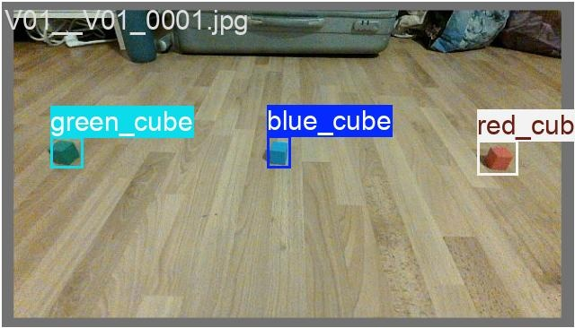 | 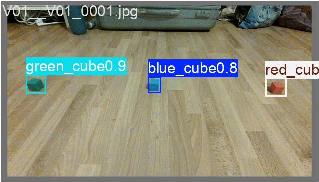 |

**Review:** Confirmed together. The model reports one green, one blue, and one red cube. Each predicted box corresponds to the matching approved cube, with no visible missed cube or additional detection. The rendered prediction confidences round to 0.9 for green and 0.8 for blue and red.

## V02

| Human-approved annotation | Saved model prediction |
|---|---|
| 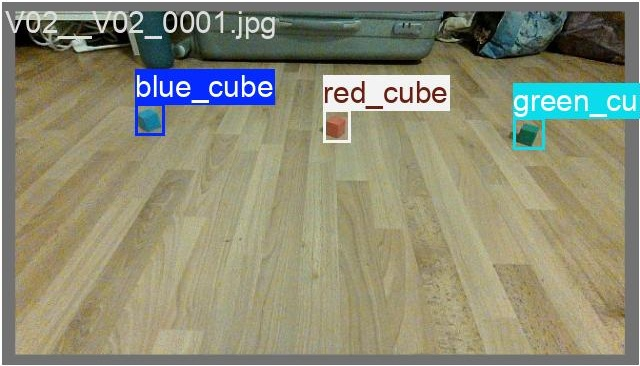 | 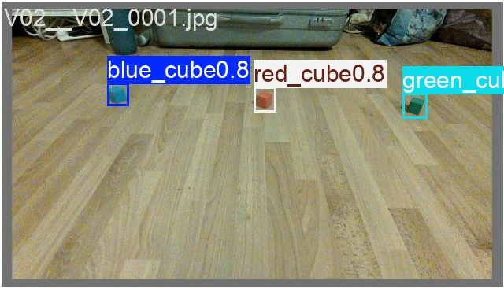 |

**Review:** Confirmed together. The model reports the approved blue, red, and green cubes at the corresponding locations. No visible cube is missed and no additional detection is visible.

## V03

| Human-approved annotation | Saved model prediction |
|---|---|
| 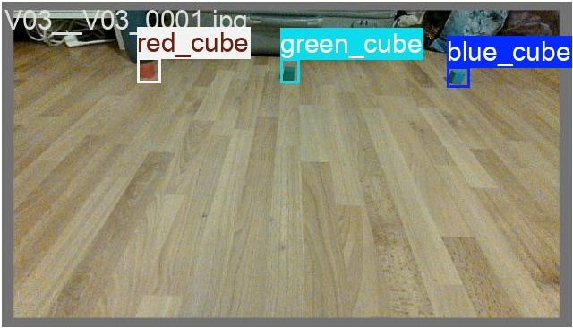 | 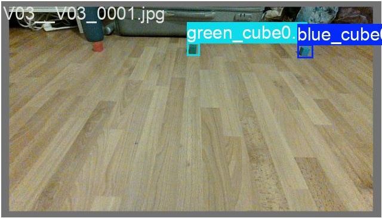 |

**Review:** Confirmed together. The approved annotation contains one red, one green, and one blue cube. The model predicts the green and blue cubes but does not predict the red cube. V03 therefore contains two visible correct detections and one false negative for the red class, with no visible additional detection.

## V04

| Human-approved annotation | Saved model prediction |
|---|---|
| 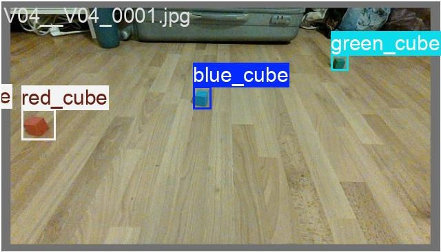 | 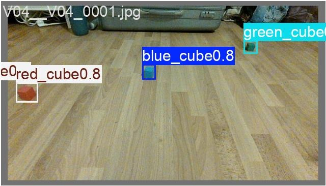 |

**Review:** Confirmed together. The model reports the approved red, blue, and green cubes at the corresponding locations. No visible cube is missed and no additional detection is visible.

## V05

| Human-approved annotation | Saved model prediction |
|---|---|
| 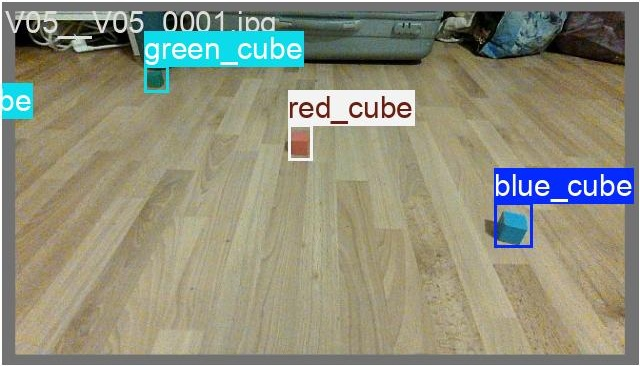 | 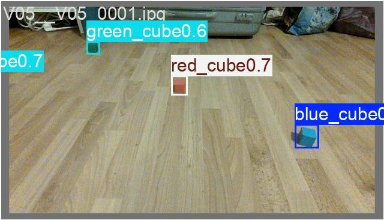 |

**Review:** Confirmed together. The model reports the approved green, red, and blue cubes at the corresponding locations. No visible cube is missed and no additional detection is visible.

## V06

| Human-approved annotation | Saved model prediction |
|---|---|
| 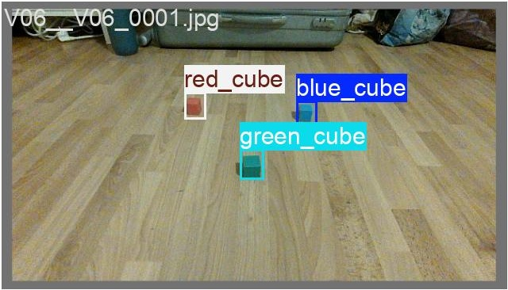 | 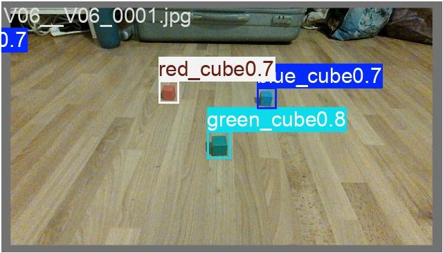 |

**Review:** Confirmed together. The model reports the approved red, blue, and green cubes at the corresponding locations. No visible cube is missed and no additional detection is visible.

## V07

| Human-approved annotation | Saved model prediction |
|---|---|
| 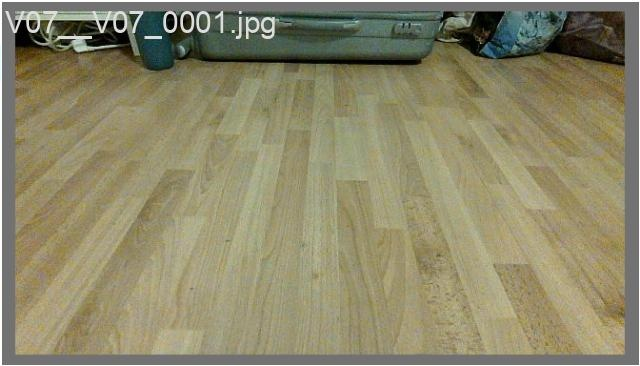 | 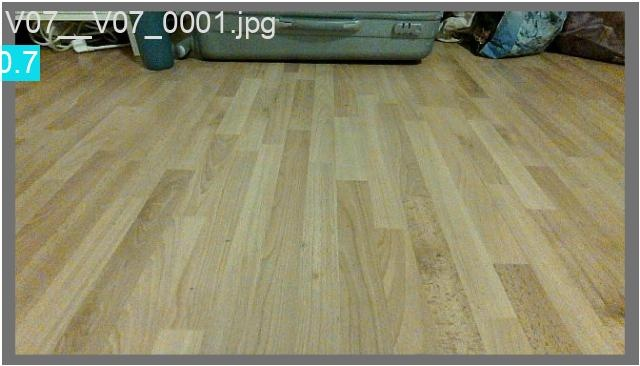 |

**Review:** Confirmed together. This is an empty-scene negative example: the approved annotation contains no cube and the model produces no detection. The clipped `0.7` at the far left is a rendering spillover from V04 in the original mosaic, not a V07 prediction.

## V08

| Human-approved annotation | Saved model prediction |
|---|---|
| 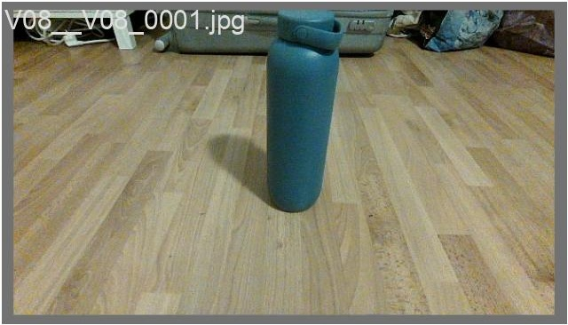 | 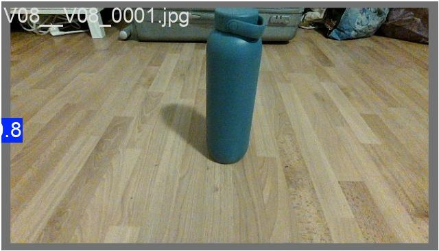 |

**Review:** Confirmed together. This negative example contains an ordinary bottle but no target cube. The model correctly produces no detection. The clipped `.8` at the far left is a rendering spillover from V05 in the original mosaic, not a V08 prediction.

## Interpretation boundary

These images show predictions on the held-out development-validation set. They help us inspect class choices, confidence labels, and box placement. They do not establish live JetRover performance; that requires a separate live test after deployment.
